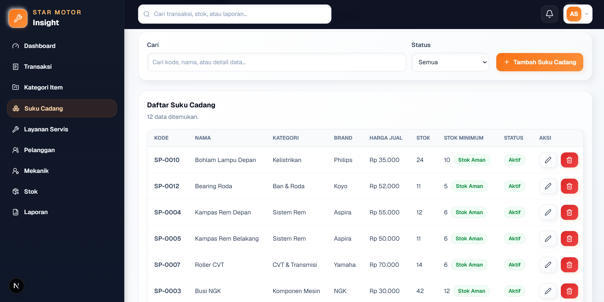
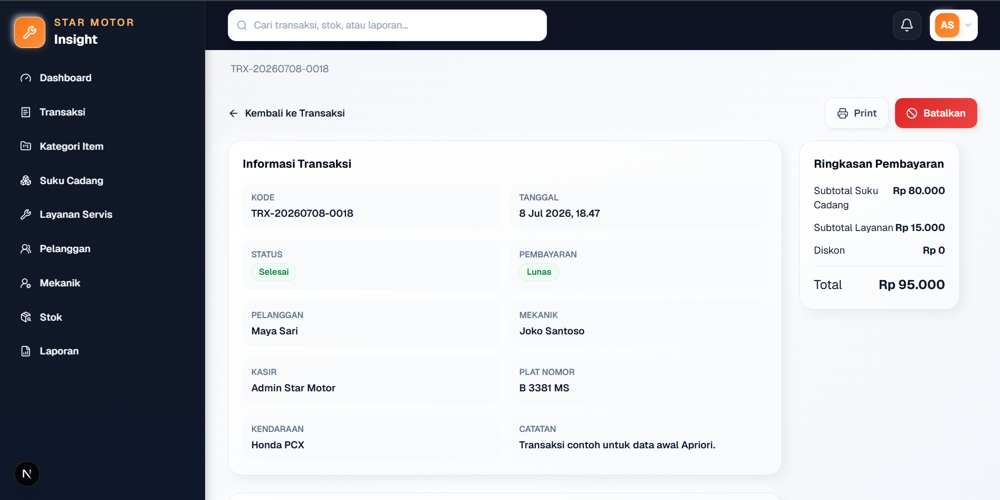
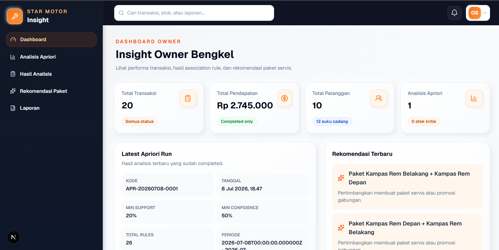
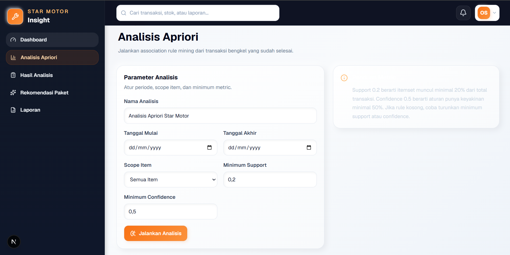
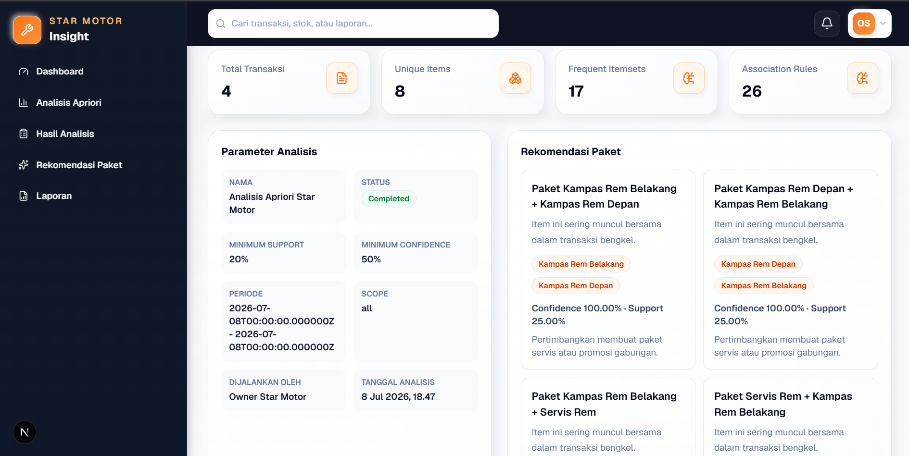
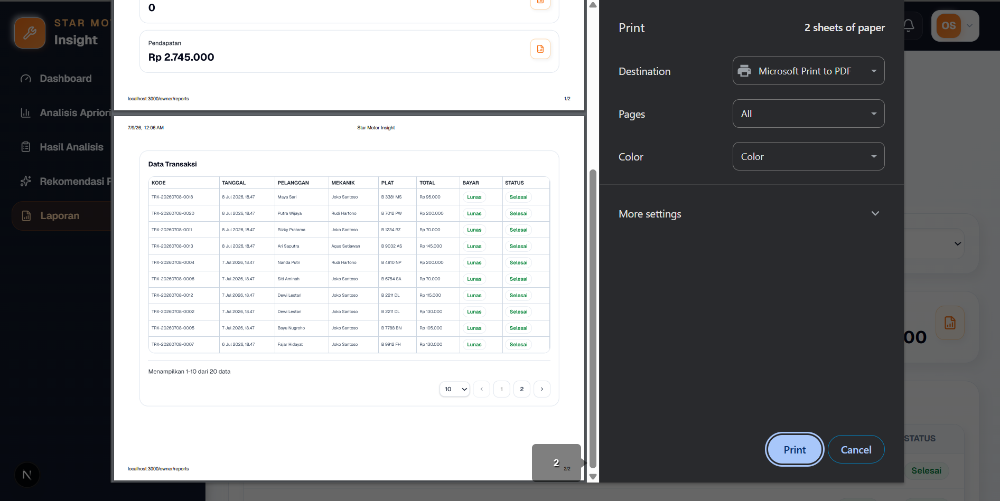

# Star Motor Apriori

**Star Motor Insight** adalah sistem transaksi bengkel motor berbasis web untuk studi kasus Bengkel Star Motor. Aplikasi ini membantu admin/kasir mengelola transaksi suku cadang dan layanan servis, memantau stok, serta membantu owner bengkel menganalisis pola pembelian pelanggan menggunakan algoritma Apriori.

Fokus utama sistem meliputi transaksi bengkel, master data suku cadang dan layanan, stok, frequent itemset, association rule, support, confidence, lift, rekomendasi paket servis, laporan, dan print laporan.

## Ringkasan Sistem

Star Motor Apriori terdiri dari tiga bagian utama:

- **Backend Laravel API** untuk autentikasi, role access, transaksi, master data, stok, laporan, dan integrasi Apriori.
- **Frontend Next.js** untuk dashboard admin/owner, form transaksi, laporan, pagination, dan UI modern clean neumorphism.
- **Apriori Service Flask** untuk memproses frequent itemset dan association rule mining dari transaksi selesai.

Alur umum sistem:

1. Admin mengelola master data bengkel.
2. Admin membuat transaksi suku cadang dan layanan servis.
3. Stok suku cadang otomatis berkurang saat transaksi selesai.
4. Owner menjalankan analisis Apriori dari transaksi selesai.
5. Sistem menghasilkan frequent itemset, association rule, dan rekomendasi paket servis.
6. Admin dan owner dapat melihat serta mencetak laporan.

## Tech Stack

### Backend

- Laravel API
- Laravel Sanctum
- PostgreSQL

### Frontend

- Next.js
- TypeScript
- Tailwind CSS
- Axios
- lucide-react

### Apriori Service

- Python Flask
- pandas
- numpy
- mlxtend
- Apriori Association Rule Mining

## Fitur Utama

### 1. Auth & Role

- Login admin dan owner.
- Protected route.
- Role-based access.
- Logout via dropdown profile.

### 2. Master Data

- Kategori item.
- Suku cadang.
- Layanan servis.
- Pelanggan.
- Mekanik.

### 3. Transaksi Bengkel

- Input transaksi bengkel.
- Item transaksi campuran suku cadang dan layanan servis.
- Total transaksi otomatis.
- Detail transaksi.
- Cancel transaksi.

### 4. Stok Suku Cadang

- Stok otomatis berkurang saat transaksi dibuat.
- Stok kembali saat transaksi dibatalkan.
- Riwayat mutasi stok.
- Status stok aman/kritis.

### 5. Analisis Apriori

- Menjalankan analisis berdasarkan transaksi selesai.
- Parameter minimum support.
- Parameter minimum confidence.
- Frequent itemset.
- Association rule.
- Lift.
- Interpretasi rule.

### 6. Rekomendasi Paket

- Rekomendasi paket berdasarkan association rule.
- Item yang sering muncul bersama.
- Support dan confidence sebagai dasar rekomendasi.

### 7. Dashboard & Laporan

- Dashboard admin.
- Dashboard owner.
- Laporan transaksi.
- Laporan stok.
- Laporan Apriori.
- Print layout khusus laporan.

### 8. UI/UX

- Modern clean neumorphism.
- Dark sidebar.
- Orange accent.
- Pagination.
- Toast notification.
- Confirm dialog.
- Loading state.
- Empty state.
- Responsive layout dasar.

## Role & Akses

### Admin / Kasir

Admin/kasir memiliki akses untuk:

- Login.
- Dashboard admin.
- Kelola kategori item.
- Kelola suku cadang.
- Kelola layanan servis.
- Kelola pelanggan.
- Kelola mekanik.
- Input transaksi.
- Melihat detail transaksi.
- Cancel transaksi.
- Melihat stok dan mutasi stok.
- Melihat laporan admin.
- Print laporan.

### Owner Bengkel

Owner bengkel memiliki akses untuk:

- Login.
- Dashboard owner.
- Menjalankan analisis Apriori.
- Melihat hasil frequent itemset.
- Melihat association rule.
- Melihat rekomendasi paket.
- Melihat laporan transaksi.
- Melihat laporan Apriori.
- Print laporan.

## Arsitektur Singkat

```text
Frontend Next.js
      |
      | Axios HTTP Request
      v
Backend Laravel API + Sanctum
      |
      | PostgreSQL
      v
Database
      |
      | HTTP request /analyze
      v
Apriori Service Flask
```

Backend bertugas mengambil transaksi selesai, mengirim dataset transaksi ke Apriori Service, lalu menyimpan hasil frequent itemset, association rule, dan rekomendasi untuk ditampilkan di dashboard owner.

## Struktur Project

```text
star-motor-apriori/
├── backend/             # Laravel API, Sanctum, PostgreSQL integration
├── frontend/            # Next.js, TypeScript, Tailwind CSS
├── apriori-service/     # Flask service untuk Apriori Association Rule Mining
├── docs/
│   └── screenshots/     # Screenshot aplikasi untuk README dan portfolio
├── .gitignore
└── README.md
```

## Screenshots

### Login Page


### Dashboard Admin


### Master Suku Cadang



### Input Transaksi


### Detail Transaksi



### Stok Suku Cadang


### Dashboard Owner



### Analisis Apriori



### Hasil Apriori



### Rekomendasi Paket


### Laporan Transaksi


### Print Preview Laporan



## Setup Backend

Masuk ke folder backend:

```bash
cd backend
composer install
copy .env.example .env
php artisan key:generate
php artisan migrate:fresh --seed
php artisan storage:link
php artisan serve --host=127.0.0.1 --port=8000
```

Contoh konfigurasi `.env` backend:

```env
APP_URL=http://127.0.0.1:8000

DB_CONNECTION=pgsql
DB_HOST=127.0.0.1
DB_PORT=5432
DB_DATABASE=star_motor_apriori
DB_USERNAME=postgres
DB_PASSWORD=your_password

FRONTEND_URL=http://localhost:3000
APRIORI_SERVICE_URL=http://127.0.0.1:5002
```

Jangan gunakan password database pribadi di repository.

## Setup Frontend

Masuk ke folder frontend:

```bash
cd frontend
npm install
copy .env.example .env.local
npm run dev
```

Contoh konfigurasi `.env.local` frontend:

```env
NEXT_PUBLIC_API_URL=http://127.0.0.1:8000/api
NEXT_PUBLIC_APP_NAME="Star Motor Insight"
```

Frontend berjalan di:

```text
http://localhost:3000
```

Route root `/` akan redirect ke `/login`.

## Setup Apriori Service

Masuk ke folder Apriori Service:

```bash
cd apriori-service
python -m venv .venv
.\.venv\Scripts\activate
pip install -r requirements.txt
python app.py
```

Jika `requirements.txt` belum tersedia, install dependency berikut:

```bash
pip install flask flask-cors pandas numpy mlxtend
```

Service berjalan di:

```text
http://127.0.0.1:5002
```

Endpoint utama service:

```text
GET  /
POST /analyze
```

## Environment Variables

### Backend

```env
APP_URL=http://127.0.0.1:8000
FRONTEND_URL=http://localhost:3000
APRIORI_SERVICE_URL=http://127.0.0.1:5002

DB_CONNECTION=pgsql
DB_HOST=127.0.0.1
DB_PORT=5432
DB_DATABASE=star_motor_apriori
DB_USERNAME=postgres
DB_PASSWORD=your_password
```

### Frontend

```env
NEXT_PUBLIC_API_URL=http://127.0.0.1:8000/api
NEXT_PUBLIC_APP_NAME="Star Motor Insight"
```

## Akun Login

Akun demo berikut dibuat melalui seeder dan hanya ditampilkan di README.

### Admin

```text
email: admin@starmotor.test
password: password
```

### Owner

```text
email: owner@starmotor.test
password: password
```

## Alur Penggunaan Sistem

1. Admin login.
2. Admin mengelola master data.
3. Admin membuat transaksi bengkel.
4. Stok suku cadang otomatis berkurang.
5. Admin dapat membatalkan transaksi jika salah input.
6. Stok kembali jika transaksi dibatalkan.
7. Owner login.
8. Owner menjalankan analisis Apriori.
9. Sistem menghasilkan frequent itemset dan association rule.
10. Owner melihat rekomendasi paket servis.
11. Owner/Admin melihat dan mencetak laporan.

## Validasi Build

### Backend

```bash
cd backend
php artisan route:list
```

### Frontend

```bash
cd frontend
npm run build
```

### Apriori Service

```bash
cd apriori-service
python app.py
```

## Catatan Pengembangan Lanjutan

Beberapa ide pengembangan lanjutan:

- Export laporan ke PDF atau Excel.
- Notifikasi stok kritis.
- Grafik analitik transaksi dan pendapatan.
- Pengaturan threshold default Apriori untuk owner.
- Audit log untuk aktivitas admin dan owner.
- Deployment production dengan queue/cache yang lebih matang.

## Catatan Portfolio / Lisensi

Project ini dibuat untuk kebutuhan pembelajaran, skripsi, dan portfolio berdasarkan studi kasus Bengkel Star Motor.

Jika digunakan ulang atau dikembangkan lebih lanjut, sesuaikan konfigurasi environment, kredensial database, dan data seed dengan kebutuhan masing-masing.
