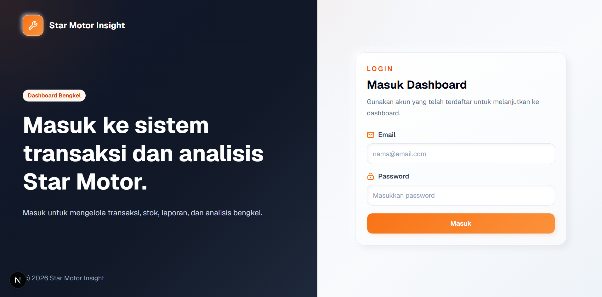
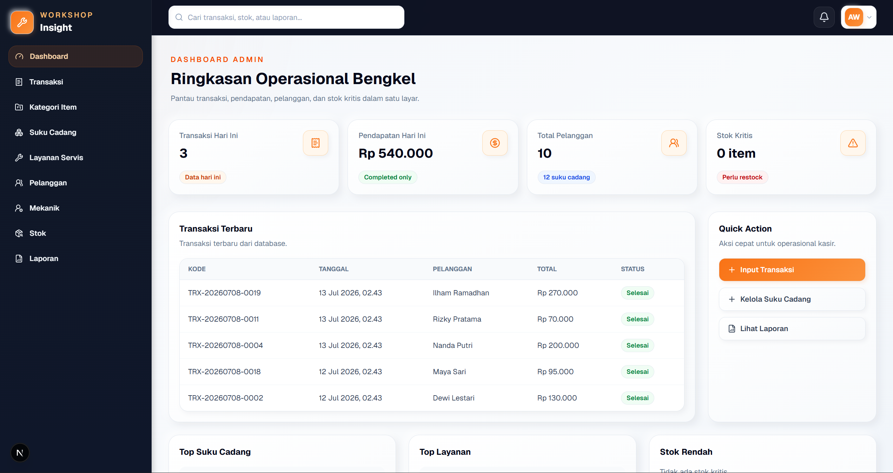
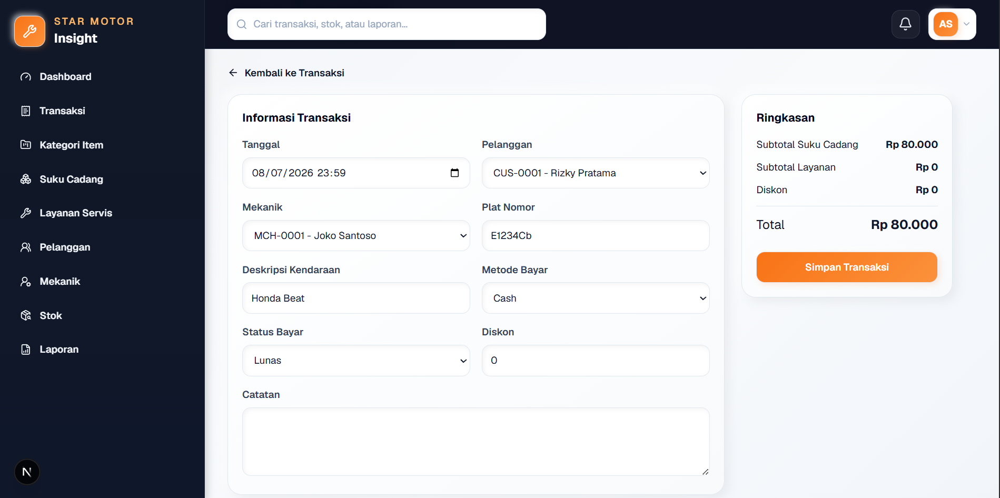
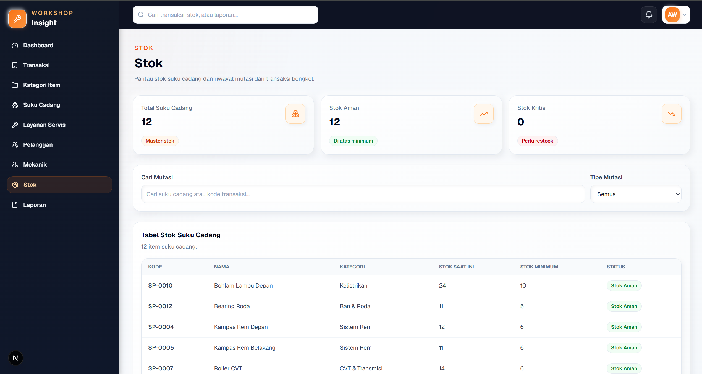
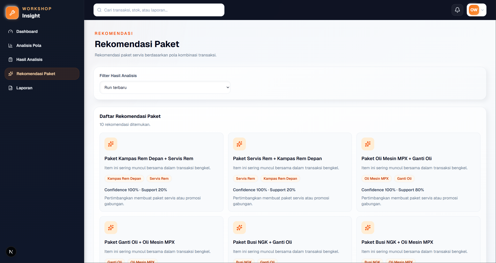
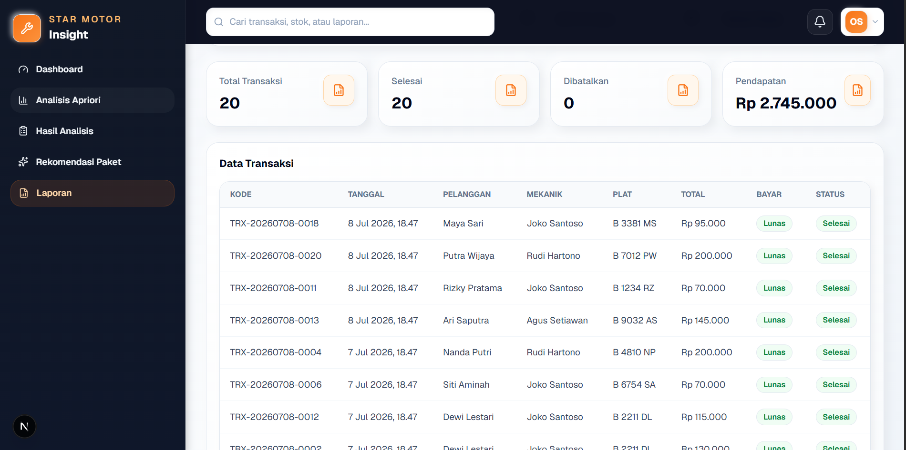

# Workshop Insight

Workshop Insight adalah aplikasi web untuk membantu pengelolaan transaksi bengkel, spare part, layanan servis, stok, dashboard, laporan, analisis pola transaksi, dan rekomendasi paket layanan berdasarkan data transaksi.

Aplikasi ini dirancang untuk mendukung operasional bengkel agar data transaksi, item layanan, spare part, stok, laporan, dan hasil analisis dapat dikelola secara lebih terstruktur dalam satu sistem.

## Ringkasan Sistem

Workshop Insight mendukung alur operasional bengkel mulai dari pengelolaan master data, pencatatan transaksi, pembaruan stok, dan penyusunan laporan hingga analisis pola transaksi dan penyusunan rekomendasi paket layanan.

Admin berfokus pada pengelolaan data operasional sehari-hari, sedangkan Owner berfokus pada pemantauan dashboard, peninjauan laporan dan hasil analisis, serta pemanfaatan insight bisnis dari data transaksi.

## Preview

Berikut beberapa tampilan utama yang menggambarkan alur penggunaan Workshop Insight untuk pengelolaan operasional dan pemantauan bisnis bengkel.

### Login



### Dashboard Admin



### Manajemen Transaksi



### Manajemen Stok



### Rekomendasi Paket Layanan



### Laporan Transaksi



## Fitur Utama

### Admin

- Login sebagai admin.
- Mengelola spare part dan layanan servis.
- Mengelola pelanggan, mekanik, dan kategori item.
- Mencatat transaksi bengkel.
- Melihat detail transaksi.
- Memantau stok dan mutasi stok.
- Melihat laporan transaksi dan stok.

### Owner

- Login sebagai owner.
- Melihat dashboard bisnis bengkel.
- Menjalankan analisis pola transaksi.
- Melihat kombinasi item yang sering muncul.
- Melihat rekomendasi paket layanan.
- Melihat laporan transaksi, stok, dan hasil analisis.

## Analisis Pola Transaksi

Sistem membaca transaksi bengkel yang telah selesai dan berisi satu atau lebih spare part dan/atau layanan servis. Data transaksi tersebut kemudian dianalisis untuk menemukan kombinasi item yang sering muncul secara bersamaan.

Hasil analisis menggunakan beberapa metrik utama:

- **Support** menunjukkan seberapa sering suatu item atau kombinasi item muncul dalam seluruh transaksi yang dianalisis.
- **Confidence** menunjukkan kemungkinan kemunculan item tujuan ketika item awal terdapat dalam transaksi.
- **Lift** menunjukkan kekuatan hubungan antaritem dibandingkan dengan kemunculan keduanya secara independen.

Hasil ini dapat digunakan sebagai bahan pendukung untuk menyusun rekomendasi paket layanan, memahami pola transaksi pelanggan, dan membantu pengambilan keputusan bisnis. Hasil analisis tetap perlu ditinjau bersama konteks operasional bengkel.

## Tech Stack

### Backend

- Laravel API
- Laravel Sanctum
- PostgreSQL
- REST API

### Frontend

- Next.js
- TypeScript
- Tailwind CSS

### Analysis Service

- Flask
- Python
- Pandas
- mlxtend

### Tools

- Composer
- NPM
- Git

## Project Structure

```text
workshop-insight/
├── backend/
├── frontend/
├── analysis-service/
├── docs/
│   └── screenshots/
└── README.md
```

Nama layanan di atas bersifat konseptual. Nama folder internal dipertahankan untuk kompatibilitas project.

## Database Overview

Tabel inti berikut merepresentasikan data autentikasi, master data, transaksi bengkel, mutasi stok, serta penyimpanan hasil analisis:

- `users`
- `item_categories`
- `spare_parts`
- `service_items`
- `customers`
- `mechanics`
- `transactions`
- `transaction_items`
- `stock_movements`
- `analysis_runs`
- `analysis_itemsets`
- `analysis_rules`

## Main Workflow

### Admin Flow

`Master Data → Transaction Entry → Stock Update → Reports`

Admin menyiapkan master data yang diperlukan, mencatat transaksi bengkel, memantau perubahan stok yang terkait dengan transaksi, lalu meninjau laporan operasional.

### Owner Flow

`Dashboard → Run Pattern Analysis → Review Analysis Result → Review Package Recommendation → Reports`

Owner memantau ringkasan bisnis melalui dashboard, menjalankan analisis pola transaksi, meninjau hasil dan rekomendasi paket layanan, lalu menggunakan laporan sebagai bahan evaluasi.

## Role Pengguna

Workshop Insight memiliki dua role utama dengan akses yang disesuaikan melalui role-based access:

- **Admin** bertanggung jawab mengelola data operasional, meliputi spare part, layanan servis, pelanggan, mekanik, transaksi, stok, dan laporan.
- **Owner** bertanggung jawab memantau performa bisnis, meninjau laporan, menjalankan analisis pola transaksi, dan meninjau rekomendasi paket layanan.

## Developer Role

- Menganalisis alur pengelolaan transaksi dan stok bengkel.
- Merancang arsitektur terpisah untuk backend, frontend, dan analysis service.
- Mengembangkan backend API menggunakan Laravel, Sanctum, PostgreSQL, dan REST API.
- Membangun halaman frontend menggunakan Next.js, TypeScript, dan Tailwind CSS.
- Mengembangkan analysis service menggunakan Flask, Python, Pandas, dan mlxtend.
- Menerapkan role-based access untuk Admin dan Owner.
- Mengembangkan fitur transaksi, spare part, layanan servis, stok, laporan, analisis, dan rekomendasi paket layanan.
- Menyiapkan akun demo, screenshot, dan dokumentasi project.

## Installation

Pastikan PostgreSQL, PHP, Composer, Node.js, NPM, dan Python telah tersedia sebelum menjalankan setiap layanan. Jalankan backend, frontend, dan analysis service pada terminal terpisah.

### Backend Setup

```bash
cd backend
composer install
cp .env.example .env
php artisan key:generate
php artisan migrate --seed
php artisan serve --host=127.0.0.1 --port=8000
```

### Frontend Setup

```bash
cd frontend
npm install
npm run dev
```

### Analysis Service Setup

Dari root project, gunakan Windows PowerShell untuk masuk ke folder service Python, membuat virtual environment, memasang dependensi, dan menjalankan service:

```powershell
Set-Location (Get-ChildItem -Directory *-service | Select-Object -First 1 -ExpandProperty FullName)
python -m venv .venv
.\.venv\Scripts\Activate.ps1
pip install -r requirements.txt
python app.py
```

## Environment Example

Salin konfigurasi berikut ke file environment masing-masing layanan, lalu sesuaikan kredensial database dengan lingkungan lokal.

### Backend `.env`

```env
APP_NAME="Workshop Insight"
APP_URL=http://127.0.0.1:8000

DB_CONNECTION=pgsql
DB_HOST=127.0.0.1
DB_PORT=5432
DB_DATABASE=workshop_insight
DB_USERNAME=postgres
DB_PASSWORD=your_password

FRONTEND_URL=http://localhost:3000
PATTERN_ANALYSIS_SERVICE_URL=http://127.0.0.1:5002
```

### Frontend `.env.local`

```env
NEXT_PUBLIC_API_URL=http://127.0.0.1:8000/api
NEXT_PUBLIC_APP_NAME="Workshop Insight"
```

## Demo Accounts

Akun berikut tersedia setelah proses seeding untuk mengakses fitur sesuai role masing-masing:

| Role | Email | Password |
|---|---|---|
| Admin | `admin@workshop.test` | `password` |
| Owner | `owner@workshop.test` | `password` |

## Validation Commands

Gunakan perintah berikut untuk membersihkan cache dan memeriksa route backend, memvalidasi lint serta build frontend, dan memastikan analysis service dapat dijalankan.

### Backend

```bash
php artisan optimize:clear
php artisan route:list
```

### Frontend

```bash
npm run lint
npm run build
```

### Analysis Service

```bash
python app.py
```

## Project Status

Workshop Insight telah diselesaikan sebagai sistem manajemen bengkel berbasis web. Sistem mencakup pengelolaan transaksi, pengelolaan stok, pelaporan, analisis pola transaksi, dan rekomendasi paket layanan.

Pengembangan berikutnya dapat mencakup grafik dashboard lanjutan, ekspor laporan, audit log, notifikasi, permission yang lebih terperinci, pengujian otomatis, konfigurasi deployment, serta penyempurnaan UI/UX.

## Catatan Pengembangan Lanjutan

- Ekspor laporan ke Excel/PDF.
- Grafik dashboard yang lebih lengkap.
- Audit log aktivitas pengguna.
- Permission yang lebih detail.
- Unit test dan integration test.
- Deployment setup.
- Optimasi analysis service.
